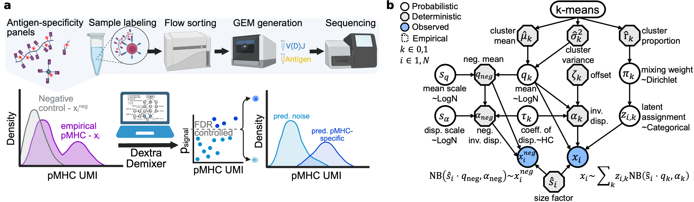

# DextraDemixer

DextraDemixer is a Python package for identifying antigen-specific T cells from pMHC multimer experiments.

The package implements the mixture model described in [**DextraDemixer enables accurate identification of antigen-specific T cells from pMHC multimer experiments**](https://www.biorxiv.org/content/10.64898/2026.06.23.733339v1)

DextraDemixer models pMHC multimer UMI counts to distinguish antigen-specific binders from nonspecific binders, enabling more accurate identification of T cells recognizing specific peptide–MHC targets.

DextraDemixer is under active development. We are continuously improving the usability, documentation, and functionality of the package. Feedback and contributions are welcome.

## Installation and Tutorial
The easiest way to install DextraDemixer into your existing environment is to run
```bash
pip install dextrademixer
```

Alternatively, install DextraDemixer in editable/development mode:

```bash
git clone git@github.com:SchubertLab/DextraDemixer.git
cd DextraDemixer
## Uncomment if you want to use the pinned dependency versions used for the results in the paper for reproducibility
# conda env create -f environment.yaml  
# conda activate dextrademixer
pip install -e .
```

A tutorial can be found in `Tutorial.ipynb`.

## Reproducibility

Due to version differences in dependencies (e.g. `jax`, `numpyro`, `optax`), results may differ slightly from run to run and across environments. For full reproducibility of the results reported in our paper, please use the exact pinned environment and code in the [DextraDemixer_reproducibility](https://github.com/SchubertLab/DextraDemixer_reproducibility) repository.

## Citation

If you found this tool helpful for your research, please cite:

```bibtex
@article {An2026DextraDemixer,
author = {An, Yang and Drost, Felix and Bonafonte-Pard{\`a}s, Irene and Grotz, Myriam and Schober, Kilian and Schubert, Benjamin},
title = {DextraDemixer enables accurate identification of antigen-specific T cells from pMHC multimer experiments},
elocation-id = {2026.06.23.733339},
year = {2026},
doi = {10.64898/2026.06.23.733339},
publisher = {Cold Spring Harbor Laboratory},
URL = {https://www.biorxiv.org/content/early/2026/06/25/2026.06.23.733339},
journal = {bioRxiv}
}
```
